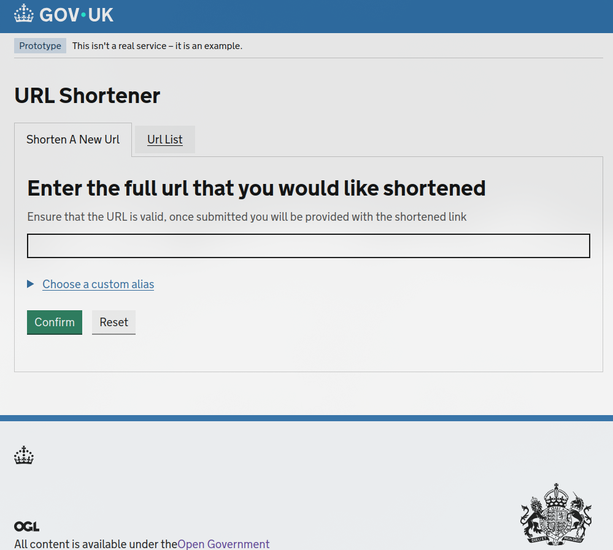
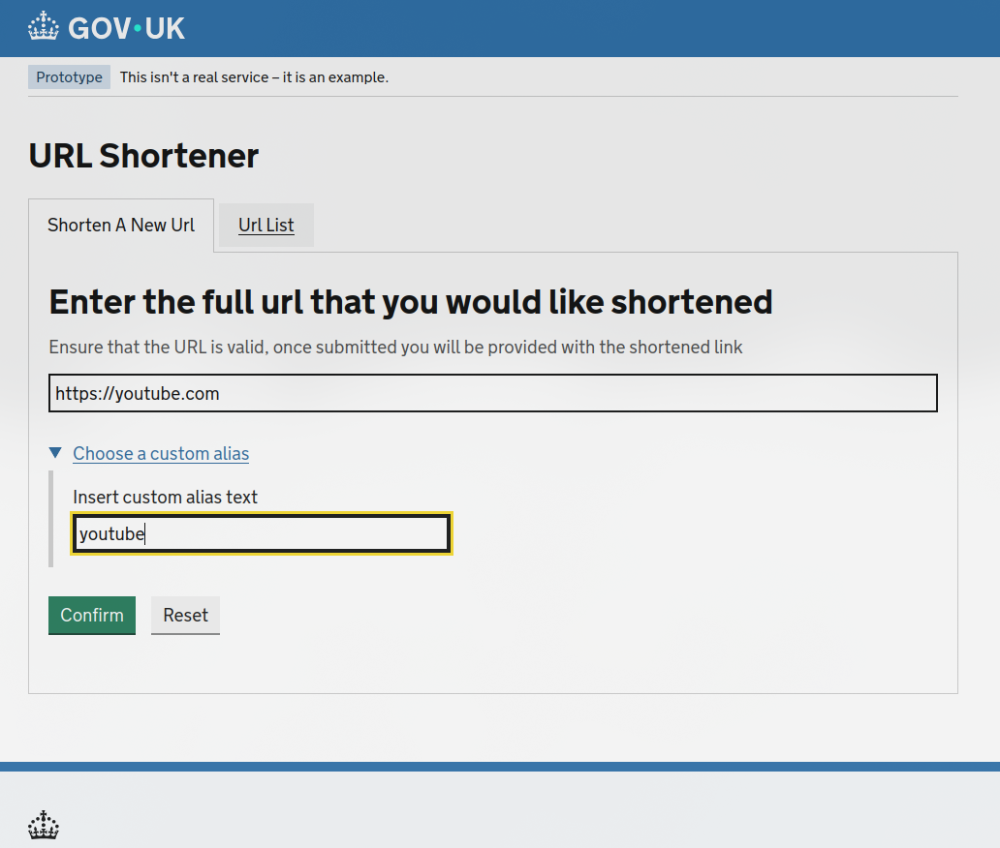
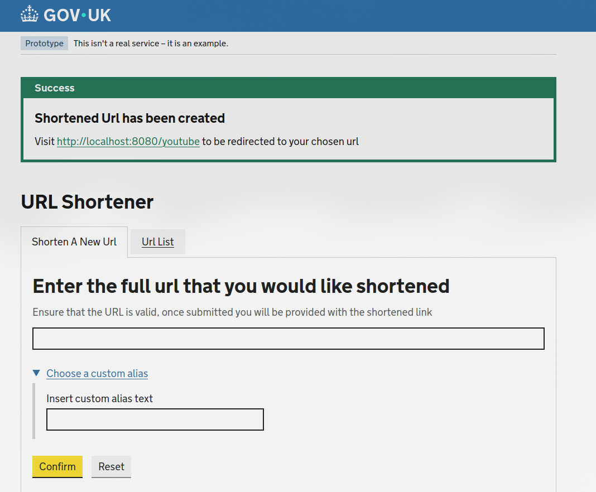
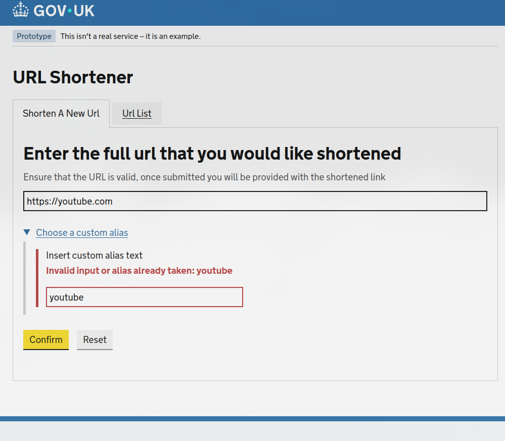
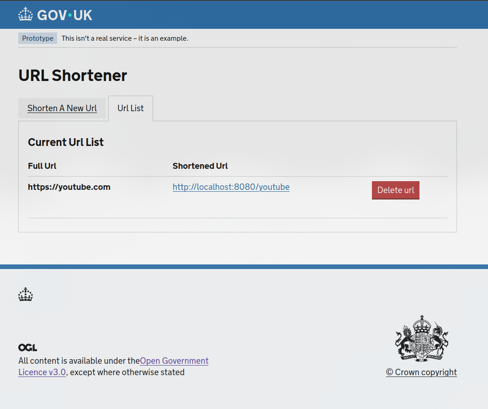

# URL Shortener Coding Exercise

## Initial Thoughts
Before starting the actual implementation, here are some initial thoughts and design decisions that will shape the final solution:

* The tech-stack:
  * React will be used for the Front-End
  * Java Spring Boot will be used for the Back-End
  * H2 will be used as an in memory database for simplicity sake. This can be configured through docker-compose env variables and could theoretically be swapped to a different database (Aurora/RDS) in a production environment.
  * With the simplicity of the application (Create, Read, Delete operations), there isn't any real need to break the backend up into microservices. Following clean code principles allows for easy refactoring into seperate services (EG. Shortening Service & Redirect Service).
* Test Driven Development will be closely followed as to ensure high amounts of meaningful code coverage on implementation. 
* Certain performance decisions can be taken which are easy to implement in the Backend:
  * Both the requested URL and the shortened url should be stored in the Database as HASH indexes, this will allow for O(1) lookups
  * Use caching strategies to alleviate database congestion and improve through-put (in the event that this was to become popular and used frequently). 
 * Collision management: 
   *  If a user shortens a link that already exists, the same alias will be returned.
   * If a user shortens a link with an alias that already exists, a 400 Bad Request will be returned. 
 * Short Code generation: 
   * Short code generation will be the result of a random string generator.

## Getting Started

### Prerequisites
* Just Docker!

### Set up
This take home project has sacrificed some clean structure in order to have a very simple setup. To get started:
1. Clone this branch: git clone 
```
https://github.com/RorryKelly/code-exercise-java.git
```
2. Change to the git directory: 
```
cd code-exercise-java
```
3. Checkout the correct branch: 
```
git checkout "rorry/delivery"
```
4. Compose Up: 
```
docker compose up --build
```
5. Connect to the front end
```
http://localhost:3000
```

## Example Usage

### Front End
Connect to the front end using the default endpoint set up in the docker-compose file
```
http://localhost:3000
```
Once you connect to the front end you will be presented with the shortener form


The form requires users to enter in a valid url, but users may enter a custom alias if they wish


Once the url has been entered, a success message will be presented - the success message with give the user


If a user tries to enter a custom alias which is already in use, they will be presented with an error


Users can view a full list of  URLs by selecting the `URL List` tab


## API Examples

Base URL:

```bash
http://localhost:8080
```

---

### Shorten a URL

#### With a custom alias

```bash
curl -X POST http://localhost:8080/shorten \
  -H "Content-Type: application/json" \
  -d '{
    "fullUrl": "https://example.com/very/long/url",
    "customAlias": "my-custom-alias"
  }'
```

**Response**

```json
{
  "shortUrl": "http://localhost:8080/my-custom-alias"
}
```

#### Without a custom alias

```bash
curl -X POST http://localhost:8080/shorten \
  -H "Content-Type: application/json" \
  -d '{
    "fullUrl": "https://example.com/very/long/url"
  }'
```

**Response**

```json
{
  "shortUrl": "http://localhost:8080/aB3xYz"
}
```

---

### Redirect to Original URL

Follow the redirect:

```bash
curl -L http://localhost:8080/my-custom-alias
```

Inspect the redirect response:

```bash
curl -I http://localhost:8080/my-custom-alias
```

**Response**

```http
HTTP/1.1 302 Found
Location: https://example.com/very/long/url
```

---

### List All Shortened URLs

```bash
curl http://localhost:8080/urls
```

**Response**

```json
[
  {
    "alias": "my-custom-alias",
    "fullUrl": "https://example.com/very/long/url",
    "shortUrl": "http://localhost:8080/my-custom-alias"
  },
  {
    "alias": "aB3xYz",
    "fullUrl": "https://google.com",
    "shortUrl": "http://localhost:8080/aB3xYz"
  }
]
```

---

### Delete a Shortened URL

```bash
curl -X DELETE http://localhost:8080/my-custom-alias
```

**Response**

```http
HTTP/1.1 204 No Content
```

---

### Error Examples

#### Alias already exists

```bash
curl -X POST http://localhost:8080/shorten \
  -H "Content-Type: application/json" \
  -d '{
    "fullUrl": "https://example.com",
    "customAlias": "my-custom-alias"
  }'
```

**Response**

```http
HTTP/1.1 400 Bad Request
```

```json
{
  "message": "Alias already taken"
}
```

#### Alias not found

```bash
curl http://localhost:8080/does-not-exist
```

**Response**

```http
HTTP/1.1 404 Not Found
```